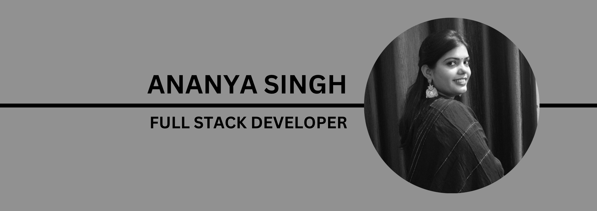

# **Turning ideas into interactive web realities.**  
  

I'm a **passionate Full Stack Developer** with over **2+ years of experience** building seamless, scalable, and innovative web applications. My expertise lies in harnessing modern technologies to deliver engaging user experiences and robust solutions. I'm committed to **continuous learning** and thrive in dynamic environments where creativity meets technology.

## **💡 About Me**  
- 🌟 **Driven by creativity**: I love turning complex ideas into user-friendly applications.  
- 💻 **Tech-savvy explorer**: Skilled in **JavaScript, React, and Node.js**, always expanding my arsenal.  
- 🎯 **Goal-oriented**: Focused on **clean code**, scalability, and intuitive design.  
- 🚀 **Innovator at heart**: Exploring new challenges in **full-stack development** and beyond.  

## **🛠️ Tech Stack**  

  

### **✨ Fun Facts About Me**  
- 🧩 Competitive coder, solving problems with **C++** on the side.  
- 🍃 Believer in work-life balance, with a love for yoga and the occasional tech meet-up.  
- 💬 Always up for tech talk or brainstorming sessions!

## **🌐 Let's Connect!**  

  
  

## **📈 GitHub Analytics**  

   
  

### 🔗 *Ready to collaborate? Let's build something amazing together!*  
